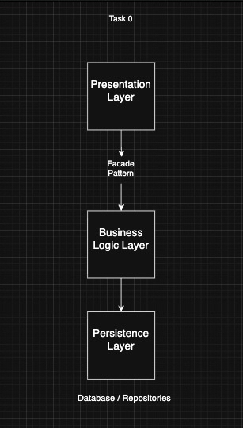
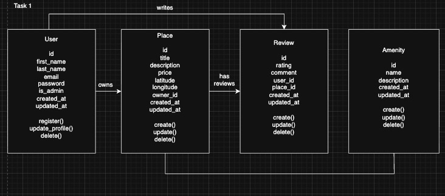
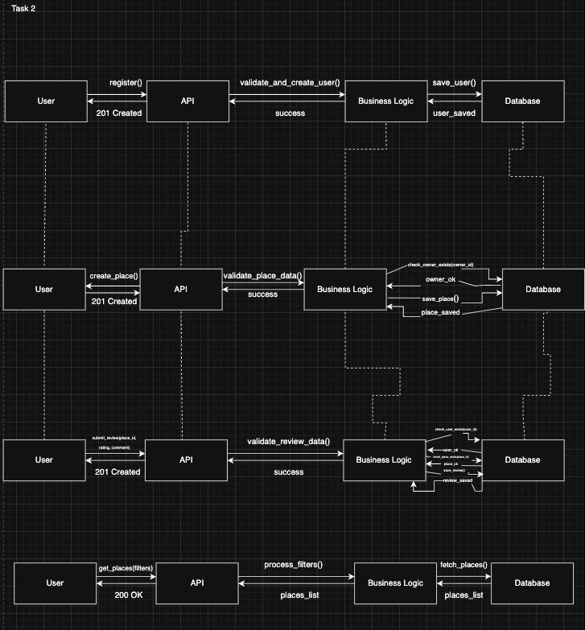

# HBnB Evolution - Technical Documentation

## 1. Introduction
This document serves as the comprehensive technical blueprint for the **HBnB Evolution** project. It outlines the system's architecture, details the core business logic entities using UML Class Diagrams, and illustrates the dynamic flow of information through API interactions using UML Sequence Diagrams. This documentation guides the development team during implementation, ensuring adherence to the designed architecture.

---

## 2. High-Level Architecture
The application follows a **Layered Architecture** pattern, promoting separation of concerns, modularity, and scalability.

### Layer Responsibilities
*   **Presentation Layer (Services, API)**: The interface layer responsible for handling incoming HTTP requests, performing initial input validation, and formatting JSON responses. It communicates exclusively with the Business Logic Layer, never accessing the database directly.
*   **Business Logic Layer (Models)**: Encapsulates the core system intelligence. It defines the Domain Models (User, Place, Review, Amenity) and implements business rules, data validation, and processing logic.
*   **Persistence Layer (Data Access)**: Abstraction layer for data storage. It utilizes the Repository Pattern to handle CRUD (Create, Read, Update, Delete) operations, isolating the business logic from the specific database implementation (SQL/NoSQL).

### The Facade Pattern
We employ the **Facade Design Pattern** to mediate communication between the Presentation and Business Logic layers. The Facade provides a simplified, unified interface to the complex underlying subsystems of the business logic. This reduces coupling and ensures the API layer remains lightweight and focused on request handling.

---

## 3. Business Logic Layer
The following **UML Class Diagram** depicts the static structure of the domain model, defining entities, their attributes, methods, and relationships.

### Entities (Classes)
*   **User**: Represents a registered actor in the system.
    *   *Attributes*: `id` (UUID), `email`, `password` (hashed), `first_name`, `last_name`.
    *   *Methods*: `register()`, `update_profile()`, `delete()`.
*   **Place**: Represents a property listing created by a User.
    *   *Attributes*: `id`, `title`, `description`, `price`, `latitude`, `longitude`.
    *   *Methods*: `create()`, `update()`, `delete()`.
*   **Review**: Represents feedback associated with a Place.
    *   *Attributes*: `id`, `rating` (integer), `comment` (text).
    *   *Methods*: `create()`, `update()`, `delete()`.
*   **Amenity**: Represents a feature or facility (e.g., Wifi, Pool).
    *   *Attributes*: `id`, `name`, `description`.

### Relationships & Multiplicity
*   **User 1 -- * Place (Association)**: A single `User` instance can own multiple `Place` instances. The ownership is defined by the `owner_id` foreign key in the Place entity.
*   **User 1 -- * Review (Association)**: A `User` can author multiple `Review`s.
*   **Place 1 -- * Review (Aggregation/Association)**: A `Place` can have many associated `Review`s.
*   **Place * -- * Amenity (Association)**: A `Place` can feature multiple `Amenity`s, and an `Amenity` can belong to multiple `Place`s (Many-to-Many relationship).

---

## 4. API Interaction Flow
The following **UML Sequence Diagrams** illustrate the dynamic behavior of the system for key use cases, showing the chronological sequence of message exchanges between the layers.

### Use Case Interaction Flows

#### A. User Registration
1.  **Presentation (API)**: Receives a `POST /users` request with registration data.
2.  **Business Logic**: Validates email uniqueness and enforces password strength policies.
3.  **Persistence**: If valid, persists the new `User` object to the data store.
4.  **Response**: Returns `201 Created` to the client.

#### B. Place Creation
1.  **Presentation (API)**: Receives a `POST /places` request with listing details and an `auth_token`.
2.  **Business Logic**: Authenticates the token and validates the `User` (owner) existence.
3.  **Persistence**: Saves the new `Place` record linked to the `owner_id`.
4.  **Response**: Returns `201 Created` with the new Place resource.

#### C. Review Submission
1.  **Presentation (API)**: Receives `POST /places/{id}/reviews`.
2.  **Business Logic**: Verifies that both the `User` (author) and the target `Place` exist.
3.  **Persistence**: Stores the `Review` with references to the User and Place.
4.  **Response**: Returns `201 Created`.

#### D. Fetching a List of Places
1.  **Presentation (API)**: Receives `GET /places` with optional query parameters (filters).
2.  **Business Logic**: Processes filter criteria (e.g., price range, location radius).
3.  **Persistence**: Executes a query against the repository to retrieve matching records.
4.  **Response**: Returns `200 OK` with a JSON array of `Place` objects.